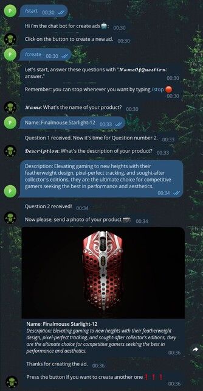

# Ad Creation Chat Bot
This project implements a chat bot using the aiogram library in Python for creating ads. The bot allows users to provide information about their product, including the name, description, and a photo, which is then uploaded to the ImgBB image hosting service. The ad information is also sent to an API endpoint to create the ad on a website.

## Prerequisites
Before running the code, make sure you have the following dependencies installed:
- aiogram
- requests
You can install them using pip:
```shell
# Install dependencies
$ pip install aiogram
$ pip install requests
```

## API Key and Token Configuration
To run the chat bot script successfully, you need to configure the Telegram Bot API token and the ImgBB API key. 

Follow the instructions below to set them up correctly:

### Telegram Bot API Token
1. Go to the BotFather in Telegram and create a new bot by following the instructions provided.

2. Once you have created the bot, BotFather will provide you with an API token. Copy the token.

3. Replace 'YOUR_TELEGRAM_BOT_TOKEN' with the API token you obtained from BotFather. The line should now look like:

```python
bot = Bot(token='YOUR_TELEGRAM_BOT_TOKEN')
```
### ImgBB API Key
1. Go to the ImgBB website and create an account or log in if you already have one.

2. After logging in, navigate to the API section.

3. Copy the API key provided on that page.

4. Replace 'YOUR_IMGBB_API_KEY' with the API key you obtained from the ImgBB website. The line should now look like:
```python
def upload_image_to_imgbb(image_path):
    # Prepare the POST request parameters
    payload = {
        'key': 'YOUR_IMGBB_API_KEY',
    } 
```
## How to use it
1) Start a chat with the bot.

2) Use the following commands to interact with the bot:

- ***/start***: Initializes the chat and displays a button to create a new ad.
- ***/create***: Starts the process of creating a new ad.
- ***/stop***: Stops the current ad creation process and displays a button to create another ad.

3) Follow the instructions provided by the bot to answer questions about the ad. You will be asked for the name, description, and a photo of the product.

4) After providing the required information, the bot will upload the photo to ImgBB and send a message with the ad details, including the photo.

5) The ad details, including the name, description, and media URL, will also be sent to the API endpoint specified in the code to create the ad on a website.


## Chat example




## API Reference

#### Post a new ad:

```https
  Post https://socialccapi.azurewebsites.net/api/v1/AnnuncioAPI/CreaAnnuncio
```

| Parameter | Type     | Description                |
| :-------- | :------- | :------------------------- |
| `titolo` | `string` | **Ad** title. |
| `descrizione` | `string` | **Ad** description.|
| `media` | `string` | **Link** returned by imgbb.  |

We have provided a public API endpoint **CreaAnnuncio** that doesn't require token verification. It allows users to create ads about a specific product without being validated.

#### Post image on imgbb
```python
requests.post('https://api.imgbb.com/1/upload', payload, files=files)
```
**Payolad** and **Files** must be json format like:
```python
payload = {
    'key': "553304cd513118a5ae948b8978f9743a",
}
files = {
    'image': open(image_path, 'rb'),
}
```
## Authors

- [@Pietroolivoni](https://github.com/pietroolivoni)


## License
This project is licensed under the MIT License. Feel free to use, modify, and distribute the code as per the terms of the license.
[MIT](https://choosealicense.com/licenses/mit/)
